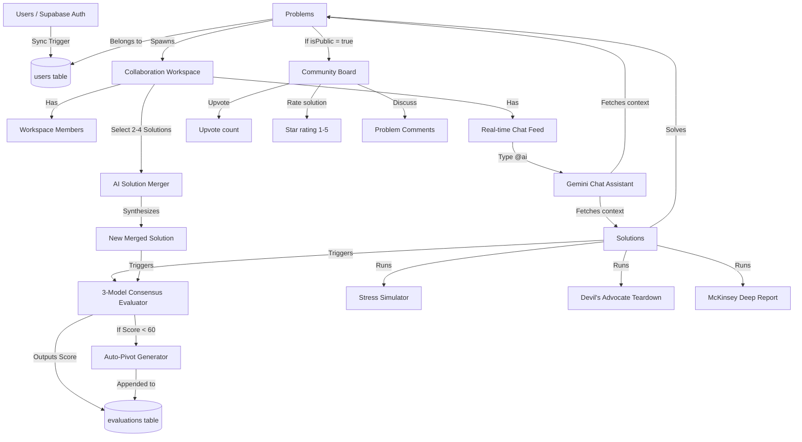

# Idea Checker — Complete Project Workflows and Feature Log

This document provides a detailed breakdown of all features, technical components, and user workflows implemented in **Idea Checker**. It traces how individual features link, share data, and trigger follow-up actions across guest sessions and registered workspaces.

---

## 1. System Integration & Workflow Linkages

The following diagram illustrates how the core data structures and workflows link to one another:

---

## 2. Complete Feature Directory

### 2.1 Access Control, Session & Authentication

#### Guest Session Manager (Cookie-Based)
- **Technical Path**: [src/middleware.ts](file:///c:/Abhijeet/Projects/Idea%20Checker/src/middleware.ts) & [src/lib/supabase/middleware.ts](file:///c:/Abhijeet/Projects/Idea%20Checker/src/lib/supabase/middleware.ts)
- **Workflow**:
  - Checks incoming HTTP requests for a `guest_session_id` cookie.
  - If missing, generates a unique UUID on the server, saving it for 1 year (`httpOnly: false`, `sameSite: 'lax'`).
  - Allows anonymous visitors to submit quick and guided evaluations, run stress simulations, upvote problems, and view reports.

#### Supabase Auth Synchronization Trigger
- **Technical Path**: [supabase/policies_and_triggers.sql](file:///c:/Abhijeet/Projects/Idea%20Checker/supabase/policies_and_triggers.sql)
- **Workflow**:
  - PostgreSQL trigger function `public.handle_new_user()` is attached to the `auth.users` table.
  - On sign-up, user ID, email, name, and timestamp are synchronized to the `public.users` table automatically.

#### Route Guards
- **Technical Path**: [src/lib/supabase/middleware.ts](file:///c:/Abhijeet/Projects/Idea%20Checker/src/lib/supabase/middleware.ts)
- **Workflow**:
  - Intercepts requests for dashboard (`/dashboard`) and problem paths (`/problems`). If the user is unauthenticated, they are redirected to `/login`.
  - Redirects logged-in users attempting to visit `/login` or `/register` to `/dashboard`.

---

### 2.2 Consensus score AI Evaluator

#### Two Evaluation Ingestion Paths
- **Technical Path**: [src/app/page.tsx](file:///c:/Abhijeet/Projects/Idea%20Checker/src/app/page.tsx), [src/components/quick-eval-form.tsx](file:///c:/Abhijeet/Projects/Idea%20Checker/src/components/quick-eval-form.tsx), [src/components/guided-eval-form.tsx](file:///c:/Abhijeet/Projects/Idea%20Checker/src/components/guided-eval-form.tsx)
- **Workflow**:
  - **Quick Evaluation**: Input textboxes for problem title, description, and solution description.
  - **Guided Evaluation (Interactive Questionnaire)**: Users select an industry domain (SaaS, Healthcare, E-commerce, Edtech, Fintech, Hardware, Social) and fill out a step-by-step form. Answers are compiled on-the-fly into a formatted proposal using `assembleAnswersIntoSolution()`.

#### Rate Throttler
- **Technical Path**: [src/lib/ratelimit.ts](file:///c:/Abhijeet/Projects/Idea%20Checker/src/lib/ratelimit.ts) & [src/app/api/evaluate/route.ts](file:///c:/Abhijeet/Projects/Idea%20Checker/src/app/api/evaluate/route.ts)
- **Workflow**:
  - Uses Upstash Redis to verify token limits.
  - Guests are limited to **3 evaluations per day** (keyed by `guest:guestSessionId:IP`).
  - Registered users have higher rate thresholds.

#### Parallel Multi-Model Pipeline
- **Technical Path**: [src/lib/evaluator.ts](file:///c:/Abhijeet/Projects/Idea%20Checker/src/lib/evaluator.ts) & [src/app/api/evaluate/route.ts](file:///c:/Abhijeet/Projects/Idea%20Checker/src/app/api/evaluate/route.ts)
- **Workflow**:
  - Fires parallel queries to 3 OpenRouter models: **Llama 3.3 70B**, **GPT OSS 120B**, and **Nemotron 3 120B**.
  - If any model fails or exceeds a 25-second limit, the evaluator runs a backup query to the **Nvidia Nemetron** model.
  - If all models fail, it returns an evaluation error.

#### Consensus Scoring and Aggregation
- **Technical Path**: [src/lib/evaluator.ts](file:///c:/Abhijeet/Projects/Idea%20Checker/src/lib/evaluator.ts)
- **Workflow**:
  - Aggregates ratings across 5 key dimensions: **Feasibility, Effectiveness, Scalability, Cost Efficiency, Innovation** (0–10 scale).
  - Computes the average overall score on a scale of 0-100.
  - Consolidates a unique list of up to 4 strengths, 4 weaknesses, and a consensus summary.
  - Returns a **Consensus Trust Index** (High, Medium, or Low Trust) based on the number of successfully aggregated models.

#### Domain-Specific Prompt Injection
- **Technical Path**: [src/lib/evaluator.ts](file:///c:/Abhijeet/Projects/Idea%20Checker/src/lib/evaluator.ts)
- **Workflow**:
  - Tailors evaluations by injecting specific directives (e.g. HIPAA/FDA pathways for Healthcare, regulatory fraud risk for Fintech, network-effect bootstrapping for Social).

---

### 2.3 Ideation Assistants & Pivoting

#### Auto-Pivot Suggestions
- **Technical Path**: [src/lib/solution-generator.ts](file:///c:/Abhijeet/Projects/Idea%20Checker/src/lib/solution-generator.ts) & [src/components/pivot-suggestions.tsx](file:///c:/Abhijeet/Projects/Idea%20Checker/src/components/pivot-suggestions.tsx)
- **Workflow**:
  - Automatically triggered during evaluation if the overall consensus score falls **below 60/100**.
  - Calls Gemini AI to suggest alternative angles, detailing: Pivot Title, Description, Rationale, and Estimated Score Lift.
  - Displayed inside the Consensus Score tab to help users improve low-scoring ideas.

#### AI Solution Draft Generator (Streaming)
- **Technical Path**: [src/app/api/generate-solution/route.ts](file:///c:/Abhijeet/Projects/Idea%20Checker/src/app/api/generate-solution/route.ts) & [src/components/solution-form.tsx](file:///c:/Abhijeet/Projects/Idea%20Checker/src/components/solution-form.tsx)
- **Workflow**:
  - A helper button inside the Solution Form allows users to auto-generate a solution proposal based on the problem statement.
  - Streams the generated markdown/text chunk-by-chunk using a `ReadableStream` reader and updates the client-side state dynamically.

---

### 2.4 Downstream Idea Stress Analyzers

#### Scenario Stress Simulator
- **Technical Path**: [src/lib/simulation.ts](file:///c:/Abhijeet/Projects/Idea%20Checker/src/lib/simulation.ts) & [src/components/stress-test-view.tsx](file:///c:/Abhijeet/Projects/Idea%20Checker/src/components/stress-test-view.tsx)
- **Workflow**:
  - Pressure-tests the solution against a hypothetical risk.
  - Users can select presets (e.g. 50% budget cut, major competitor launch) or write custom scenarios.
  - Returns a Resilience Score (0–100), full written analysis, vulnerabilities, strengths, and recommendations.

#### Devil's Advocate Teardown
- **Technical Path**: [src/lib/devil-advocate-generator.ts](file:///c:/Abhijeet/Projects/Idea%20Checker/src/lib/devil-advocate-generator.ts) & [src/components/devil-advocate-view.tsx](file:///c:/Abhijeet/Projects/Idea%20Checker/src/components/devil-advocate-view.tsx)
- **Workflow**:
  - Generates a brutally honest audit of why the solution will fail.
  - Lists Fatal, Severe, and Moderate failure reasons.
  - Highlights overlooked competitors, founder traps (cognitive biases), and explicit conditions under which the founder must reconsider their strategy.

#### McKinsey-Style Deep Report
- **Technical Path**: [src/lib/deep-report-generator.ts](file:///c:/Abhijeet/Projects/Idea%20Checker/src/lib/deep-report-generator.ts) & [src/components/deep-report-view.tsx](file:///c:/Abhijeet/Projects/Idea%20Checker/src/components/deep-report-view.tsx)
- **Workflow**:
  - Generates a complete business validation report covering: Executive Summary, Problem Validation (0–10 score & analysis), Market Sizing (TAM/SAM/SOM), Competitive Landscape (players & differentiation), Business Model Viability (pricing, economics), Technical Feasibility, GTM strategy, regulatory issues, execution risks, and a final overall rating (Promising, Needs Work, or Abandon).

---

### 2.5 Multi-Solution Merging

#### Solution Merging (AI Synthesis)
- **Technical Path**: [src/lib/solution-merger.ts](file:///c:/Abhijeet/Projects/Idea%20Checker/src/lib/solution-merger.ts) & [src/components/merge-solutions-dialog.tsx](file:///c:/Abhijeet/Projects/Idea%20Checker/src/components/merge-solutions-dialog.tsx)
- **Workflow**:
  - Users select **2 to 4** solution variants.
  - Gemini AI acts as a startup strategist, combining best elements, resolving contradictions, and generating a single synthesized proposal.
  - Inserts the merged solution with `isMerged: true` and `mergedFromIds: [...]` to database, then automatically runs a consensus evaluation.

---

### 2.6 Collaboration Workspaces & Real-time Chat

#### Team workspaces
- **Technical Path**: [src/app/(dashboard)/workspace/[id]/page.tsx](file:///c:/Abhijeet/Projects/Idea%20Checker/src/app/%28dashboard%29/workspace/%5Bid%5D/page.tsx) & [src/components/create-workspace-dialog.tsx](file:///c:/Abhijeet/Projects/Idea%20Checker/src/components/create-workspace-dialog.tsx)
- **Workflow**:
  - Problem owners can create a dedicated team workspace.
  - Generates an invite code/link. Guests/other users visiting this link are authenticated and added as 'editor' members.

#### Real-time Workspace Chat
- **Technical Path**: [src/components/workspace-chat.tsx](file:///c:/Abhijeet/Projects/Idea%20Checker/src/components/workspace-chat.tsx)
- **Workflow**:
  - Installs a Supabase Realtime channel subscription listening to `INSERT` events in the `workspace_messages` table matching the `workspaceId`.
  - Incorporates optimistic UI message rendering, which is updated when the server response or realtime event arrives.

#### Workspace AI Chat Assistant (`@ai`)
- **Technical Path**: [src/app/api/workspace/[id]/messages/route.ts](file:///c:/Abhijeet/Projects/Idea%20Checker/src/app/api/workspace/%5Bid%5D/messages/route.ts)
- **Workflow**:
  - When a message starts with `@ai`, the POST handler intercepts it.
  - It fetches the problem statement and the top 3 solutions with their evaluation scores.
  - Injects this context into a Gemini model, which responds directly inside the workspace chat feed.

---

### 2.7 Community Board & Feedback

#### Public Board Sharing & Toggling
- **Technical Path**: [src/components/visibility-toggle.tsx](file:///c:/Abhijeet/Projects/Idea%20Checker/src/components/visibility-toggle.tsx) & [src/app/(dashboard)/community/page.tsx](file:///c:/Abhijeet/Projects/Idea%20Checker/src/app/%28dashboard%29/community/page.tsx)
- **Workflow**:
  - Allows owners to toggle problem visibility (public/private).
  - Public problems are listed on the Community board. Can be sorted by Latest or Top Upvoted.

#### Upvoting & Star Ratings
- **Technical Path**: [src/components/upvote-button.tsx](file:///c:/Abhijeet/Projects/Idea%20Checker/src/components/upvote-button.tsx) & [src/components/community-score-widget.tsx](file:///c:/Abhijeet/Projects/Idea%20Checker/src/components/community-score-widget.tsx)
- **Workflow**:
  - Registered users can upvote public problems (max one upvote per problem).
  - Users can rate solutions with 1 to 5 stars. The solution average rating and total counts are refreshed immediately.

#### Comments Thread
- **Technical Path**: [src/components/comment-section.tsx](file:///c:/Abhijeet/Projects/Idea%20Checker/src/components/comment-section.tsx) & [src/app/api/comments/route.ts](file:///c:/Abhijeet/Projects/Idea%20Checker/src/app/api/comments/route.ts)
- **Workflow**:
  - Enables comment threads on public problem pages.
  - Comment deletion is permitted for the comment author OR the parent problem owner.

#### Score Timeline
- **Technical Path**: [src/components/score-timeline.tsx](file:///c:/Abhijeet/Projects/Idea%20Checker/src/components/score-timeline.tsx)
- **Workflow**:
  - Shows history of evaluations on a solution.
  - Clicking an older timeline node loads its specific scores, strengths, weaknesses, and pivot advice.
